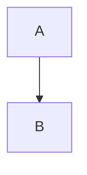

> A quote
>
> - with a list
> - inside

```rust
fn main() {
    println!("hi");
}
```

````md
```nested fence```
````

---


```mermaid
graph TD
  A --> B
```

```kawruh-canvas
c1a2b3
```


<div>raw html</div>
